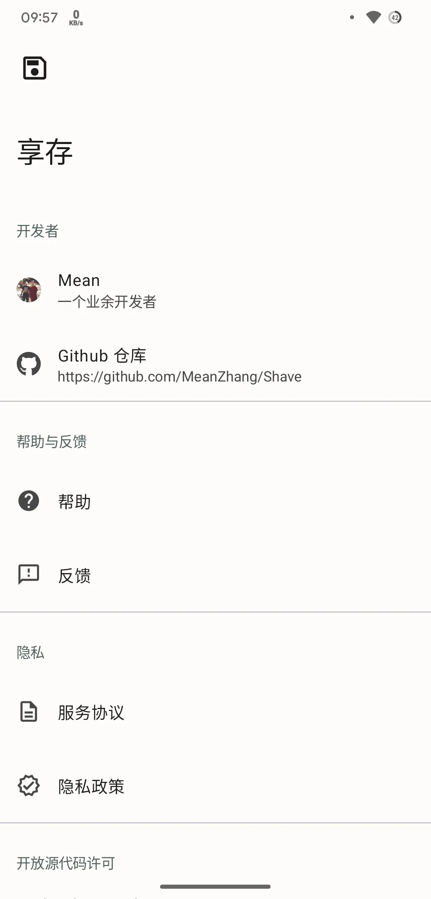
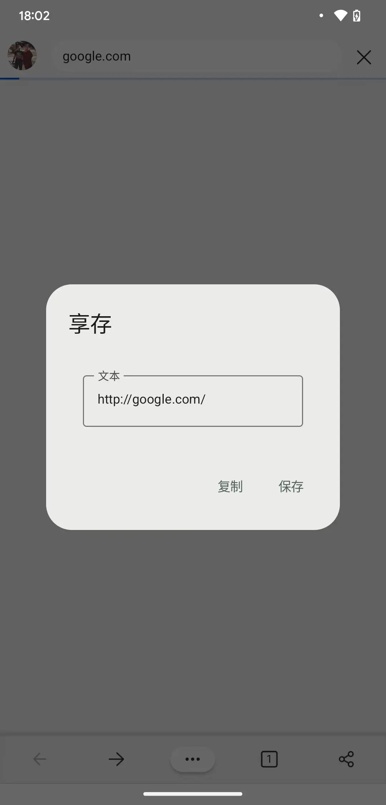
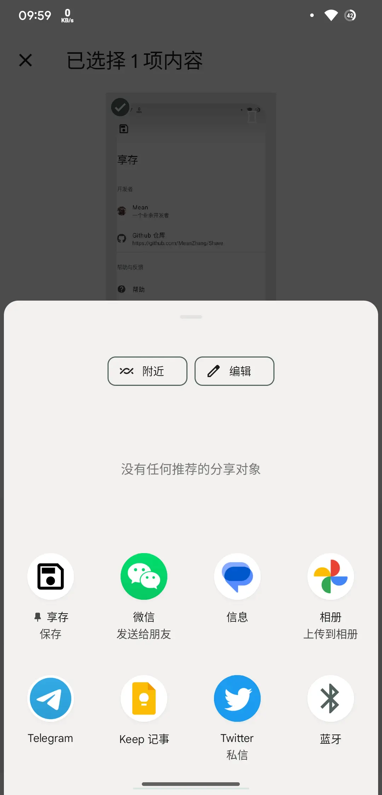

# 享存

  
  
  
  

享存是一款可以将分享内容保存为文件的应用，支持文本、图片和任意类型文件。通过分享菜单或打开方式中的享存 APP，使用[存储访问框架](https://developer.android.google.cn/training/data-storage/shared/documents-files?hl=zh-cn)（Storage Access Framework, SAF）保存在本地文件中，无需获取任何权限。

使用 Jetpack Compose 构建，采用 Material You 设计。

| 主界面                   | 文本分享                             | 分享菜单                             |
| ------------------------ | ------------------------------------ | ------------------------------------ |
|  |  |  |
