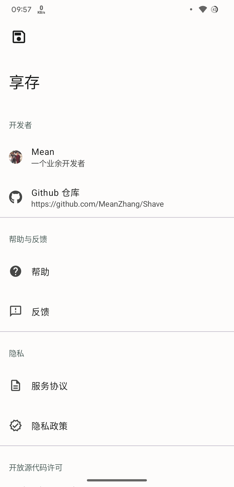
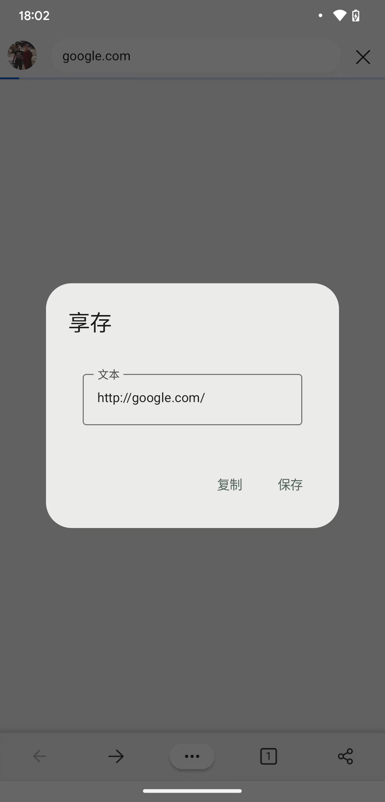
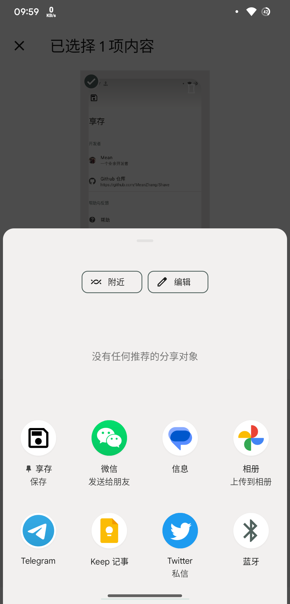

---
# https://vitepress.dev/reference/default-theme-home-page
layout: home

hero:
  name: "享存"
  tagline: "一款可以将分享内容保存为文件的应用"
  actions:
    - theme: brand
      text: 使用帮助
      link: /help
features:
  - title: 分享即保存
    details: 从分享或打开菜单即可保存文件
  - title: 无需权限
    details: 无需授予任何权限，
---

享存是一款可以将分享内容保存为文件的应用，支持文本、图片和任意类型文件。通过分享菜单或打开方式中的享存 APP，使用[存储访问框架](https://developer.android.google.cn/training/data-storage/shared/documents-files?hl=zh-cn)（Storage Access Framework, SAF）保存在本地文件中，无需获取任何权限。

使用 Jetpack Compose 构建，采用 Material You 设计。

| 主界面                     | 文本分享                               | 分享菜单                               |
| -------------------------- | -------------------------------------- | -------------------------------------- |
|  |  |  |
